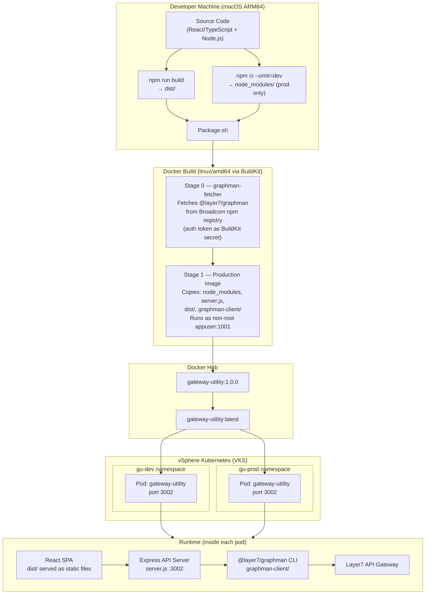

# Gateway Utility — Rebuild & Deployment Guide

## Rebuild Steps (Run in Order)

> Run these every time you need to rebuild and redeploy the Gateway Utility image.

---

### Pre-flight Checks

Before rebuilding, confirm the three prerequisites are satisfied:

| # | What | How to Check | How to Refresh |
|---|------|-------------|----------------|
| 1 | **kubectl VKS token** | `kubectl auth can-i get pods -n gu-dev` → must return `yes` | `kubectl vsphere login --server https://10.160.125.134 --vsphere-username bala@content.tmm.broadcom.lab --insecure-skip-tls-verify` |
| 2 | **Docker Hub login** | `docker info \| grep Username` → must show `bradhakr` | `docker login docker.io` |
| 3 | **Broadcom npm token** | `grep "_authToken" ~/.npmrc` → must have a value | Log in at https://support.broadcom.com → My Downloads → API Token, then update `~/.npmrc` |

---

### Step 1 — Build the React Frontend Locally

```bash
cd /Users/br661896/Documents/APIM/Graphman/Scripts/GatewayUtility
npm install
npm run build
```

**Verify:**
```bash
ls dist/
# Expected: index.html  assets/
```

> This compiles the React/TypeScript UI into `dist/` — plain HTML, CSS, and JavaScript.
> Must be done on your Mac before the Docker build. Docker no longer runs npm for the frontend.

---

### Step 2 — Run the Upgrade Script

```bash
./k8s/Upgrade-Rebuild-GWUtility.sh
```

This single script does everything else automatically:

| Step | What it does |
|------|-------------|
| Pre-flight 1/3 | Verifies kubectl is authenticated to the VKS cluster |
| Pre-flight 2/3 | Verifies Docker Hub login as `bradhakr` |
| Pre-flight 3/3 | Reads Broadcom npm token from `~/.npmrc` |
| Docker build | Runs `Package.sh` — installs production `node_modules` locally, builds the image for `linux/amd64`, pushes `1.0.0` to Docker Hub |
| Re-tag latest | Re-tags `1.0.0` as `latest` on Docker Hub (registry-side, no pull needed) |
| Rolling restart | `kubectl rollout restart` on both `gu-dev` and `gu-prod` |
| Wait for rollout | Waits for both namespaces to fully roll out |

---

### Step 3 — Verify the Deployment

```bash
# Check pods are running the new image
kubectl get pods -n gu-dev -l app=gateway-utility
kubectl get pods -n gu-prod -l app=gateway-utility

# Confirm new image is pulled (look at STARTED time)
kubectl get pods -n gu-dev -l app=gateway-utility \
  -o custom-columns="NAME:.metadata.name,STATUS:.status.phase,STARTED:.status.startTime"
```

Then do a **hard refresh** in your browser (`Cmd + Shift + R`) to clear the browser cache.

---

### Troubleshooting Quick Reference

| Symptom | Cause | Fix |
|---------|-------|-----|
| `kubectl` pre-flight fails after 90 s | VKS JWT token expired (~10 h lifetime) | Re-run `kubectl vsphere login ...` |
| `Not logged in to Docker Hub` | Docker Hub session expired | `docker login docker.io` |
| `No Broadcom npm token found` | Token missing or expired in `~/.npmrc` | Refresh at support.broadcom.com |
| CrashLoopBackOff — `Cannot find module 'express'` | Production `node_modules` not in image | Re-run Step 1 + Step 2 |
| Old UI still showing after rollout | Browser cache | Hard refresh `Cmd + Shift + R` |
| `latest` tag on Docker Hub is stale | `docker tag` used stale local image | `docker buildx imagetools create --tag docker.io/bradhakr/gateway-utility:latest docker.io/bradhakr/gateway-utility:1.0.0` then rollout restart |

---

## Architecture



---

## Technologies

| Layer | Technology | Purpose |
|-------|-----------|---------|
| **Frontend** | React 18 | Single-page application UI |
| **Frontend** | TypeScript 5 | Type-safe JavaScript |
| **Frontend** | Vite 5 | Frontend bundler / build tool |
| **Frontend** | React Router v6 | Client-side routing |
| **Backend** | Node.js 20 | Server runtime |
| **Backend** | Express 4 | HTTP API server |
| **Backend** | express-session | Session management |
| **Backend** | jose | JWT / OIDC token validation |
| **Gateway CLI** | @layer7/graphman | Broadcom Layer7 API Gateway management |
| **Container** | Docker (linux/amd64) | Image packaging |
| **Container OS** | Alpine Linux (node:20-alpine) | Minimal container base |
| **Registry** | Docker Hub (`docker.io/bradhakr`) | Image storage |
| **Orchestration** | Kubernetes (VKS on vSphere) | Container orchestration |
| **Namespaces** | `gu-dev`, `gu-prod` | Dev and production environments |
| **Build tooling** | Docker BuildKit | Multi-stage image builds |

---

## Packages

### Production Dependencies
Installed at runtime inside the container.

| Package | Version | Purpose |
|---------|---------|---------|
| `express` | ^4.18.2 | HTTP web framework — serves the API and static frontend |
| `cors` | ^2.8.5 | Cross-Origin Resource Sharing middleware |
| `express-session` | ^1.19.0 | Server-side session management |
| `jose` | ^6.2.3 | JOSE / JWT library for OIDC token validation |
| `react` | ^18.2.0 | UI component library |
| `react-dom` | ^18.2.0 | React DOM renderer |
| `react-router-dom` | ^6.22.0 | Client-side routing for the SPA |

### Dev Dependencies
Used only during local development and the React build step (`npm run build`). Not included in the Docker image.

| Package | Version | Purpose |
|---------|---------|---------|
| `typescript` | ^5.3.3 | TypeScript compiler (`tsc`) |
| `vite` | ^5.1.0 | Frontend bundler — produces `dist/` |
| `@vitejs/plugin-react` | ^4.2.1 | Vite plugin for React (JSX transform) |
| `@types/react` | ^18.2.0 | TypeScript types for React |
| `@types/react-dom` | ^18.2.0 | TypeScript types for React DOM |
| `@types/cors` | ^2.8.17 | TypeScript types for cors |
| `@types/express-session` | ^1.19.0 | TypeScript types for express-session |
| `concurrently` | ^8.2.2 | Runs `npm run server` and `vite` together during `npm run dev` |
| `nodemon` | ^3.1.14 | Auto-restarts `server.js` on changes during `npm run dev` |

### External CLI Tool (installed in Docker Stage 0)
Fetched from Broadcom's private npm registry during the Docker build. Requires a valid Broadcom Artifactory auth token.

| Package | Source | Purpose |
|---------|--------|---------|
| `@layer7/graphman` | `packages.broadcom.com/artifactory/api/npm/layer7-npm` | Broadcom Layer7 API Gateway management CLI — used by the backend to import/export bundles, manage assertions, keys, and certificates |

---

## Application Pages (React UI)

| Page | Route area | Purpose |
|------|-----------|---------|
| Landing | `/` | Home / entry point |
| Gateway Login | auth | Connect to a Layer7 gateway |
| Entity Browser | entities | Browse gateway entities |
| Entity Inspector | entities | Inspect individual entity details |
| Entity Forge | entities | Create / modify entities |
| New Entity | entities | Add new gateway entities |
| Find Assertions | policies | Search policy assertions |
| Check Compliance | policies | Compliance checking |
| Replace Assertions | policies | Bulk assertion replacement |
| Keys & Certificates | certs | Manage gateway keys and certs |
| Certificate Management | certs | Certificate lifecycle management |
| Graphman Config | config | Graphman client configuration |
| Graphman Version | config | Installed graphman version info |
| Configuration | config | App configuration |
| Auth Setup | auth | OIDC / authentication setup |
| OIDC Callback | auth | OIDC redirect handler |
