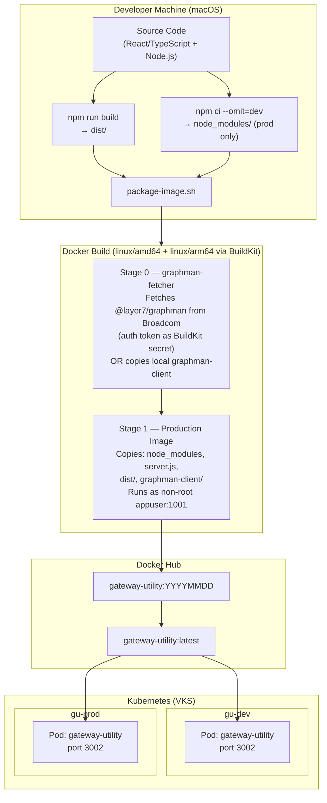

# Gateway Utility — Rebuild Guide

Run these steps every time you need to rebuild and push a new Docker image then roll it out to Kubernetes.

> For a full first-time deployment walkthrough, see [Deployment-Guide.md](./Deployment-Guide.md).  
> For local development setup and testing, see [Local-Env-Testing.md](./Local-Env-Testing.md).

---

## Pre-flight Checks

Before rebuilding, confirm all three prerequisites are satisfied:

| # | What | How to Check | How to Refresh |
|---|------|-------------|----------------|
| 1 | **kubectl VKS token** | `kubectl auth can-i get pods -n gu-dev` → must return `yes` | `kubectl vsphere login --server https://<cluster-host> --vsphere-username <user> --insecure-skip-tls-verify` |
| 2 | **Docker Hub login** | `docker info \| grep Username` → must show your Docker Hub username | `docker login docker.io` |
| 3 | **Broadcom npm token** (Mode A only) | `grep "_authToken" ~/.npmrc` → must have a value | Log in at https://support.broadcom.com → My Downloads → API Token, then update `~/.npmrc` |

> **Mode B alternative:** If you prefer not to use the Broadcom npm token, run `scripts/package-image.sh` with `--local-graphman <path>` to copy your local graphman-client into the image instead.

---

## Step 1 — Build the React Frontend Locally

```bash
cd /path/to/GatewayUtility
npm install          # skip if node_modules/ is already up to date
npm run build
```

**Verify:**
```bash
ls dist/
# Expected output: index.html  assets/
```

> This compiles the React/TypeScript UI into `dist/` — plain HTML, CSS, and JavaScript.  
> Must be done on your Mac before the Docker build. The Docker image copies `dist/` directly.

---

## Step 2 — Run the Upgrade Script

```bash
./scripts/upgrade-rebuild.sh
```

This single script does everything else automatically:

| Phase | What it does |
|-------|-------------|
| Pre-flight 1/3 | Verifies kubectl is authenticated to the cluster |
| Pre-flight 2/3 | Verifies Docker Hub login |
| Pre-flight 3/3 | Reads Broadcom npm token from `~/.npmrc` |
| Docker build | Runs `package-image.sh` — installs production `node_modules`, builds multi-platform image (`linux/amd64` + `linux/arm64`), pushes to Docker Hub |
| Re-tag `latest` | Re-tags the versioned image as `latest` on Docker Hub |
| Rolling restart | `kubectl rollout restart` on both `gu-dev` and `gu-prod` |
| Wait for rollout | Waits for both namespaces to fully roll out |

---

## Manual Rebuild (without the upgrade script)

If you need more control, run each phase manually:

### Build and push

```bash
cd /path/to/GatewayUtility

export TAG=$(date +%Y%m%d)   # date-stamped tag — recommended for rollback
TOKEN=$(cat ~/.npmrc | grep _authToken | cut -d= -f2)   # or however you retrieve it

# Mode A — Broadcom npm token
./scripts/package-image.sh \
  --npm-token "$TOKEN" \
  --registry  docker.io/<your-dockerhub-username> \
  --name      gateway-utility \
  --tag       $TAG \
  --push

# Mode B — local graphman-client (no token needed)
./scripts/package-image.sh \
  --local-graphman ../../graphman-client-main \
  --registry       docker.io/<your-dockerhub-username> \
  --name           gateway-utility \
  --tag            $TAG \
  --push

# Move the latest pointer (required — deployment.yaml uses :latest by default)
docker tag  docker.io/<your-dockerhub-username>/gateway-utility:$TAG \
            docker.io/<your-dockerhub-username>/gateway-utility:latest
docker push docker.io/<your-dockerhub-username>/gateway-utility:latest
```

### Rolling restart

```bash
kubectl rollout restart deployment/gateway-utility -n gu-dev
kubectl rollout restart deployment/gateway-utility -n gu-prod

kubectl rollout status deployment/gateway-utility -n gu-dev
kubectl rollout status deployment/gateway-utility -n gu-prod
```

---

## Step 3 — Verify the Deployment

```bash
# Pods are running the new image (check STARTED time)
kubectl get pods -n gu-dev  -l app=gateway-utility
kubectl get pods -n gu-prod -l app=gateway-utility

# Application health check
curl -sI https://gu-dev.vks.security.broadcom.com/api/health
curl -sI https://gu-prod.vks.security.broadcom.com/api/health
# Expected: HTTP/2 200

# Logs (last 30 lines)
kubectl logs -n gu-dev  deployment/gateway-utility --tail=30
kubectl logs -n gu-prod deployment/gateway-utility --tail=30
```

Then do a **hard refresh** in your browser (`Cmd + Shift + R`) to clear the cached frontend assets.

---

## Local Docker Test (no push)

To test the image locally before pushing:

```bash
npm run build   # ensure dist/ is current

./scripts/package-image.sh --local-graphman ../../graphman-client-main
# (builds image tagged gateway-utility:latest for your native platform — no push)

docker run -p 3002:3002 \
  -v $(pwd)/config.json:/app/config.json:ro \
  -v $(pwd)/auth-config.json:/app/auth-config.json:ro \
  -v $(pwd)/../../graphman-client-main/graphman.configuration:/app/graphman-client/graphman.configuration:ro \
  gateway-utility:latest

# Then open http://localhost:3002
```

---

## Troubleshooting

| Symptom | Cause | Fix |
|---------|-------|-----|
| `kubectl` pre-flight fails | VKS JWT token expired (~10 h lifetime) | Re-run `kubectl vsphere login ...` |
| `Not logged in to Docker Hub` | Docker Hub session expired | `docker login docker.io` |
| `No Broadcom npm token found` | Token missing or expired in `~/.npmrc` | Refresh at support.broadcom.com or switch to `--local-graphman` mode in `package-image.sh` |
| CrashLoopBackOff — `Cannot find module 'express'` | Production `node_modules` not copied into image | Re-run Step 1 (`npm install` + `npm run build`) then Step 2 |
| Old UI still showing after rollout | Browser cache | Hard refresh `Cmd + Shift + R` |
| `latest` tag on Docker Hub is stale | `docker tag` used stale local image | `docker buildx imagetools create --tag docker.io/<user>/gateway-utility:latest docker.io/<user>/gateway-utility:$TAG` then rollout restart |
| Pod stuck in `Pending` — `ImagePullBackOff` | Registry pull secret missing or expired | Recreate `private-registry-secret` in the namespace (see [Deployment-Guide.md](./Deployment-Guide.md) Step 11) |

---

## Architecture Overview

The diagram below shows how your Mac, Docker Hub, and the Kubernetes cluster relate during a rebuild.



---

## Technology Stack

| Layer | Technology | Purpose |
|-------|-----------|---------|
| **Frontend** | React 18 | Single-page application UI |
| **Frontend** | TypeScript 5 | Type-safe JavaScript |
| **Frontend** | Vite 5 | Frontend bundler / build tool |
| **Frontend** | React Router v6 | Client-side routing |
| **Backend** | Node.js 20 | Server runtime |
| **Backend** | Express 4 | HTTP API server |
| **Backend** | express-session | Session management (in-memory, BFF pattern) |
| **Backend** | jose | JWT / OIDC token validation (PKCE, JWKS) |
| **Gateway CLI** | graphman-client | Broadcom Layer7 API Gateway management CLI |
| **Container** | Docker BuildKit (`linux/amd64` + `linux/arm64`) | Multi-platform image packaging |
| **Container OS** | Alpine Linux (`node:20-alpine`) | Minimal container base |
| **Orchestration** | Kubernetes (VKS on vSphere) | Container orchestration |
| **Ingress** | Envoy Gateway (shared-gateway) | TLS termination, routing |
| **Namespaces** | `gu-dev`, `gu-prod` | Isolated dev and production environments |

---

## npm Packages

### Production dependencies

| Package | Version | Purpose |
|---------|---------|---------|
| `express` | ^4.18.2 | HTTP web framework |
| `cors` | ^2.8.5 | Cross-Origin Resource Sharing middleware |
| `express-session` | ^1.19.0 | Server-side session management |
| `jose` | ^6.2.3 | JOSE / JWT library for OIDC token validation |
| `react` | ^18.2.0 | UI component library |
| `react-dom` | ^18.2.0 | React DOM renderer |
| `react-router-dom` | ^6.22.0 | Client-side routing for the SPA |

### Dev dependencies (build only — not in Docker image)

| Package | Version | Purpose |
|---------|---------|---------|
| `typescript` | ^5.3.3 | TypeScript compiler (`tsc`) |
| `vite` | ^5.1.0 | Frontend bundler — produces `dist/` |
| `@vitejs/plugin-react` | ^4.2.1 | Vite plugin for React (JSX transform) |
| `@types/react` | ^18.2.0 | TypeScript types for React |
| `@types/react-dom` | ^18.2.0 | TypeScript types for React DOM |
| `@types/cors` | ^2.8.17 | TypeScript types for cors |
| `@types/express-session` | ^1.19.0 | TypeScript types for express-session |
| `concurrently` | ^8.2.2 | Runs API server and Vite together during `npm run dev` |
| `nodemon` | ^3.1.14 | Auto-restarts `server.js` on file changes |

### External CLI (fetched during Docker build)

| Package | Source | Purpose |
|---------|--------|---------|
| `@layer7/graphman` | `packages.broadcom.com/artifactory/api/npm/layer7-npm` | Broadcom Layer7 API Gateway management CLI — used by the backend to import/export bundles, manage assertions, keys, and certificates |
